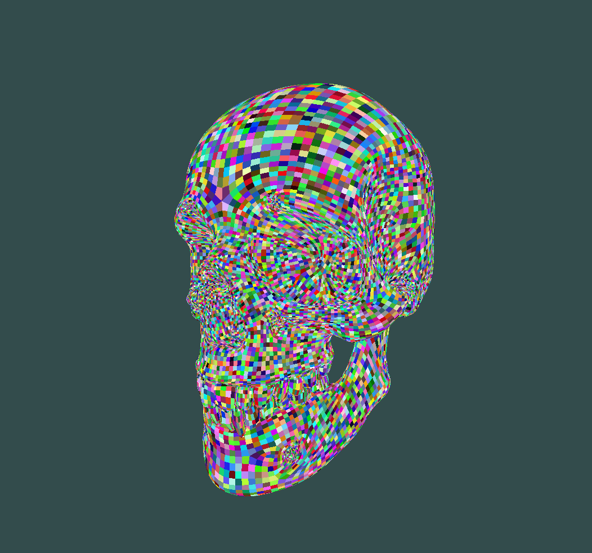

<div id="top"></div>

<div align="center">
 <a href="https://github.com/Link-Wolf/scop" title="Go to GitHub repo"></a>
 <a href="https://"></a>
 <a href="https://"></a>
 <a href="https://github.com/Link-Wolf/scop/stargazers"></a>
 <a href="https://github.com/Link-Wolf/scop/network/members"></a>
 <a href="https://github.com/Link-Wolf/scop/issues"></a>
 <a href="https://www.apple.com/macos/" title="Go to Apple homepage"></a>
</div>

<!-- PROJECT LOGO -->
<br />
<div align="center">
  <a>
    
  </a>

  <h3 align="center">scop</h3>

  <p align="center">
   <em>Basic GPU rendering with OpenGL</em><br/>
    A C++ project to render .obj files using OpenGL
    <br />
    <br />
    <a href="https://github.com/Link-Wolf/scop/issues">Report Bug</a>
    ·
    <a href="https://github.com/Link-Wolf/scop/issues">Request Feature</a>
  </p>
</div>

<!-- TABLE OF CONTENTS -->
<details>
  <summary>Table of Contents</summary>
  <ol>
    <li>
      <a href="#about-the-project">About The Project</a>
    </li>
    <li>
      <a href="#getting-started">Getting Started</a>
      <ul>
        <li><a href="#prerequisites">Prerequisites</a></li>
        <li><a href="#installation">Installation</a></li>
      </ul>
    </li>
    <li><a href="#usage">Usage</a></li>
    <li><a href="#roadmap">Roadmap</a></li>
    <li><a href="#contributing">Contributing</a></li>
  </ol>
</details>

<!-- ABOUT THE PROJECT -->

## About The Project

<div align="center">
  <a>
    
  </a>
</div>
</br>
This project aims to use OpenGL to render 3D objects using a GPU.

It takes a .obj file as an argument and renders it in perspective using OpenGL (glew).

GLFW is only used to manage the window and the inputs.

For the input, the following keys are used:

Controls :

-   TAB : Switch between FILL, LINE and POINT mode
-   M : Toggle color_type in triangle mode (monochrome, colors or normale)
-   Arrows : Move the object
-   Mouse scroll : Zoom in/out
-   T : Toggle texturing
-   R : Toggle showroom
-   +/- (numpad ): Distorce the object
-   ESC : Close the window

<p align="right">(<a href="#top">back to top</a>)</p>

<!-- GETTING STARTED -->

## Getting Started

### Prerequisites

C++ compiler (like c++)

-   clang version >= 12.0.0
-   opengl version >= 3.3
-   glfw version >= 3.3.6

### Installation

1. Clone the repo

    ```sh
    git clone https://github.com/Link-Wolf/scop.git
    ```

2. Compile the project

    ```sh
    cd scop; make
    ```

3. Execute it

    ```sh
    ./scop [path_to_obj_file]
    ```

<p align="right">(<a href="#top">back to top</a>)</p>

<!-- USAGE EXAMPLES -->

## Usage

You can render any .obj file using this program (some are [included](./models)). But note that not all features are supported.
Only vertices (`v [x] [y] [z]`) and faces (`f [v1] [v2] [v3] ...`) are supported. The rest is simply ignored.

Here are some examples of rendering the same colored skull using differents modes:

Render only the vertices / Render only the wires linking the vertices / Render the full faces

<div align="center">
 <table>
  <tr>
   <td>
    
   </td>
   <td>
    
   </td>
   <td>
    
   </td>
  </tr>
 </table>
 <p>
  Same skull rendered using a "normal shading", and using a beautiful kitten texture
 </p>
 <table>
  <tr>
   <td>
    
   </td>
   <td>
    
   </td>
  </tr>
 <table>
</div>

<p align="right">(<a href="#top">back to top</a>)</p>

<!-- ROADMAP -->

## Roadmap

-   [x] Add bonus features

See the [open issues](https://github.com/Link-Wolf/scop/issues) for a full list of proposed features (and known issues).

<p align="right">(<a href="#top">back to top</a>)</p>

<!-- CONTRIBUTING -->

## Contributing

If you have a suggestion that would make this better, please fork the repo and create a pull request. You can also simply open an issue with the tag "enhancement".
Don't forget to give the project a star! Thanks again!

1. Fork the Project
2. Create your Feature Branch (`git checkout -b feature/AmazingFeature`)
3. Commit your Changes (`git commit -m 'Add some AmazingFeature'`)
4. Push to the Branch (`git push origin feature/AmazingFeature`)
5. Open a Pull Request

<p align="right">(<a href="#top">back to top</a>)</p>
